# National Blood Transfusion Service Management System (NBT-SMS)

A centralized, scalable, and secure microservice-based platform for managing blood transfusion services across all zones in Tanzania.

## 🚀 Overview

The NBT-SMS project aims to modernize and centralize blood donation and transfusion services by connecting all zones through a unified system. It provides zone-specific services while maintaining a centralized PostgreSQL database, secured microservices, monitoring, and event-driven communication.

The system is built with:

- **Spring Boot Microservices**
- **Docker & Docker Compose**
- **Kubernetes (K8s) for container orchestration**
- **Kafka for event-driven communication**
- **Prometheus & Grafana for monitoring**
- **Zipkin for distributed tracing**
- **PostgreSQL databases for each microservice**

---

## 🛠️ Tech Stack

- **Backend:** Spring Boot (Java)
- **Databases:** PostgreSQL
- **Communication:** Kafka, Eureka Service Discovery
- **Monitoring:** Prometheus, Grafana
- **Tracing:** Zipkin
- **Containerization:** Docker
- **Orchestration:** Kubernetes

---

## 📦 Project Structure

Each microservice is fully containerized and follows the single-responsibility principle:

- `donor-service`
- `identity-service`
- `zone-service`
- `meeting-service`
- `notification-service`
- `laboratory-service`
- `discovery-server` (Eureka)
- `api-gateway`

Infrastructure services include:

- `postgres-*` databases per service
- `kafka-broker` & `zookeeper`
- `zipkin`, `prometheus`, `grafana`

---

## ⚙️ Getting Started

### Prerequisites

- [Docker](https://docs.docker.com/get-docker/)
- [Docker Compose](https://docs.docker.com/compose/)
- [Kubernetes (Optional for K8s deployment)](https://kubernetes.io/docs/tasks/tools/)

## 💡 Docker Resource Requirements

To ensure all microservices and infrastructure containers run smoothly, please make sure Docker Desktop (or your Docker Engine) is assigned **at least 8 GB of RAM**.

### How to increase Docker memory:

- **On Docker Desktop (Windows/Mac):**

  1. Open Docker Desktop.
  2. Go to **Settings** (gear icon).
  3. Navigate to **Resources** > **Advanced**.
  4. Adjust the **Memory** slider to at least **8 GB**.
  5. Click **Apply & Restart**.

- **On Linux:**

  Docker uses the host’s resources directly. Ensure your machine has enough free memory (8 GB+) and close other heavy applications if needed.

---

Failure to allocate sufficient memory may cause containers to crash or restart frequently.

### Environment Setup

1. **Clone the repository:**

   ```bash
   git clone https://github.com/CEO-LAYSON/national-blood-management-system.git
   cd national-blood-management-system
   ```

2. **Create .env file:**

   Use the provided **.env.example** to set the environment variables

   ```
   cp .env.example .env
   ```

# 📲 SMS Provider - Beem Africa

This project uses **Beem Africa** as the official SMS gateway provider for sending SMS notifications across the National Blood Transfusion Service Management System (NBT-SMS).

---

## ⚙️ SMS Integration Requirements

To successfully send SMS messages via Beem:

- You **must** apply for and obtain an approved **Sender Name** from Beem.
- You require valid API credentials provided by Beem.

---

## 📁 Required Environment Variables

Ensure the following variables are set in your `.env` file:

```env
SMS_USERNAME=
SMS_PASSWORD=
SMS_SOURCE=
SMS_URL=https://apisms.beem.africa/v1/send
```

## 🌐 Useful Links

- [Beem Africa Official Website](https://beem.africa/)
- [Beem SMS API Documentation](https://docs.beem.africa/)

Fill in the required values for databases, Kafka, Eureka, SMS, etc

## 🐳 Docker Deployment

Start all services using Docker Compose

```shell
docker compose up -d
```

Check running containers:

```shell
docker ps
```

## 📊 Monitoring & Tracing

- **Prometheus:** [http://localhost:9090](http://localhost:9090)
- **Grafana:** [http://localhost:3000](http://localhost:3000)  
  Default login: `admin / password`
- **Zipkin (Tracing):** [http://localhost:9411](http://localhost:9411)

---

## 📊 Monitoring & Tracing Dashboards

Visualizing system health and tracing distributed calls is crucial for monitoring our microservices.

---

### Grafana Dashboard

Below is the Grafana dashboard showing key metrics and system health status:

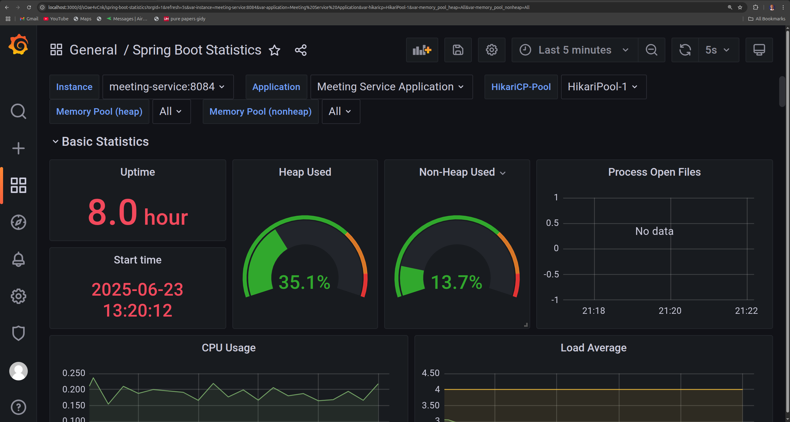

---

### Zipkin Dependency Graph

This image shows the Zipkin dependency graph illustrating service relationships and call flow:

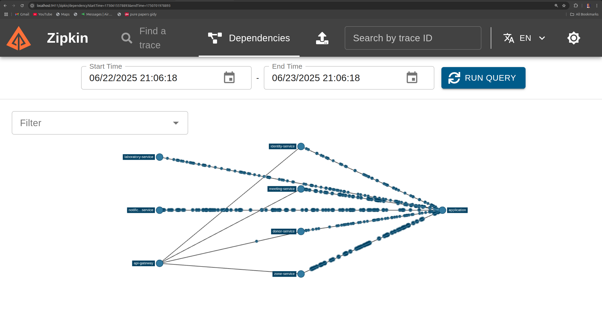

---

### Zipkin Trace View

Example of a Zipkin trace showing detailed timing and spans for requests across microservices:

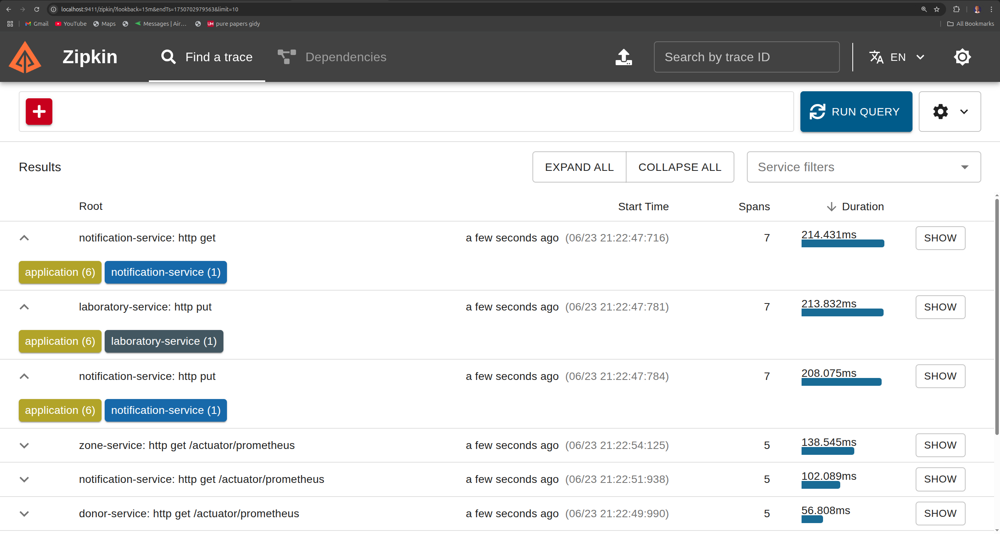

---

### Prometheus Metrics

Prometheus metrics page displaying real-time system metrics collected from services:

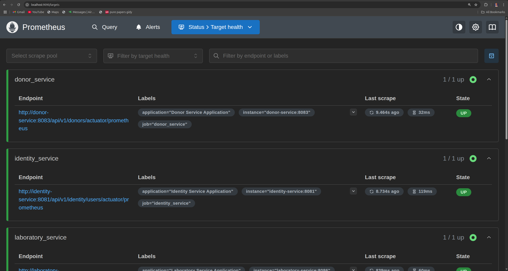

---

## Docker Running containers

Docker running containers showing CPU usage and Container memory usage

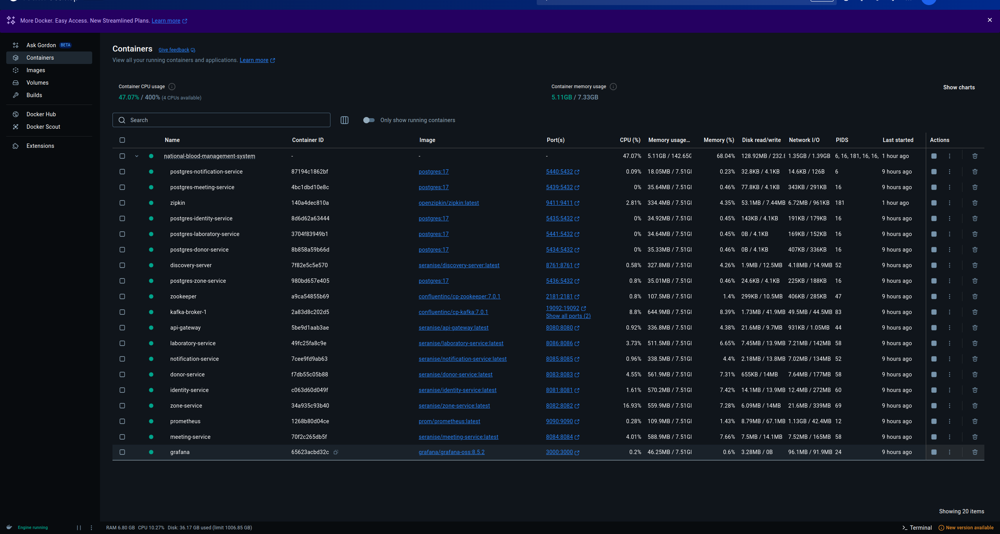

## 📊 Access Points (Example)

After deploying the system to Kubernetes, you can access the following services using the cluster's external IP:

| Service           | Access Method               |
| ----------------- | --------------------------- |
| **Eureka Server** | `http://<external-ip>:8761` |
| **API Gateway**   | `http://<external-ip>:8080` |
| **Prometheus**    | `http://<external-ip>:9090` |
| **Grafana**       | `http://<external-ip>:3000` |
| **Zipkin**        | `http://<external-ip>:9411` |

Replace `<external-ip>` with your cluster's public IP or domain name as configured in your Ingress or LoadBalancer.

---

---

## 📄 License

This project is licensed under the [MIT License](LICENSE). You are free to use, modify, and distribute this software under the terms of the MIT license.

---

## 🙏 Acknowledgements

- [Spring Boot](https://spring.io/projects/spring-boot)
- [Docker](https://www.docker.com/)
- [Kubernetes](https://kubernetes.io/)
- [Kafka](https://kafka.apache.org/)
- [Prometheus](https://prometheus.io/)
- [Grafana](https://grafana.com/)
- [Zipkin](https://zipkin.io/)
- [Beem Africa - SMS Provider](https://beem.africa/)

---

## 📧 Contact

For inquiries, support, or contributions:


# Kubernetes Deployment - National Blood Transfusion Service Management System (NBT-SMS)

## 📦 Prerequisites

- Kubernetes Cluster (Minikube, kind, or production-grade cluster)
- `kubectl` CLI installed and configured
- Docker images of all microservices pushed to a container registry accessible by the cluster
- ConfigMaps or Secrets for environment variables management

---

## 🗂️ Suggested Structure for manifests

```plaintext
k8s/
├── manifests/
│   ├── infrastructure/
│   │   ├── deployment-postgres.yaml
│   │   ├── service-postgres.yaml
│   │   ├── secrets.yaml
│   │   └── ...
│   ├── microservices/
│   └── ...
├── kind/
│   ├── create-kind-cluster.sh
│   ├── delete-microservices-cluster.sh
│   └── kind-config.yaml
```


---

## ⚙️ Step-by-step instructions

### 1. Create the Postgres Deployment manifest

You can generate the manifest with:

```bash
kubectl create deployment postgres \
  --image=postgres:17 \
  --port=5432 \
  --replicas=1 \
  --dry-run=client -o yaml > k8s/manifests/infrastructure/deployment-postgres.yaml
```

### 2. Create the Postgres Service manifest

Expose Postgres on port 5434 (cluster-internal):

```bash
kubectl create service clusterip postgres \
  --tcp=5434:5432 \
  --dry-run=client -o yaml > k8s/manifests/infrastructure/service-postgres.yaml
```

### 3. Create the Kubernetes Secret from your existing .env
Assuming .env is located at the root project folder (../../../.env from infrastructure folder):
```bash
    kubectl create secret generic app-secrets --from-env-file=../../../.env --dry-run=client -o yaml > secrets.yaml
```

### Applying the manifests
Apply all manifests in order:
```bash
  kubectl apply -f secrets.yaml
  kubectl apply -f deployment-postgres.yaml
  kubectl apply -f service-postgres.yaml
```

After applying Kubernetes Deployment and Services:

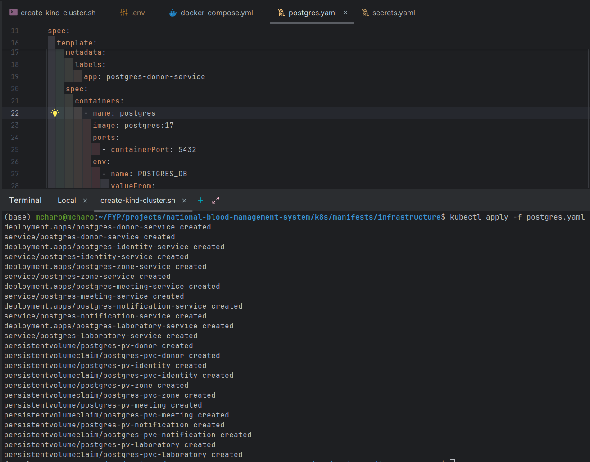

### See secrets
```shell
kubectl get secrets
```
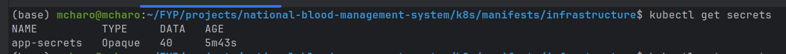

### See actual secrets
```shell
kubectl get secret app-secrets -o yaml
```
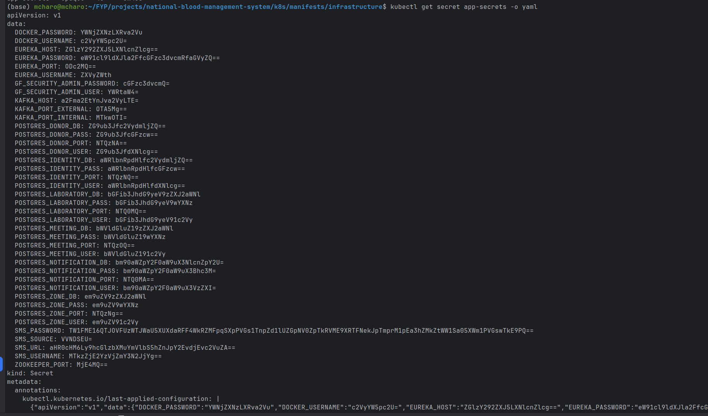

### See Kubernetes cluster created
```shell
kubectl get all
```
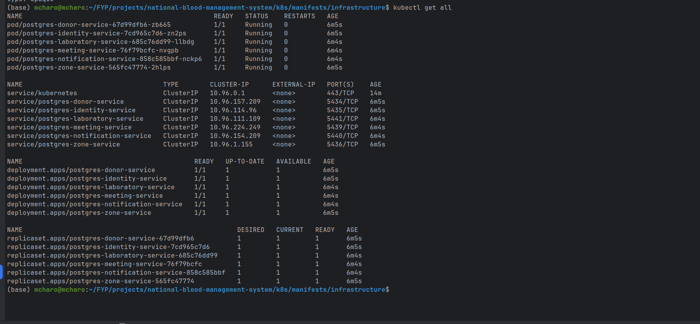

### Checking pods and status
```shell
kubectl get pods
```
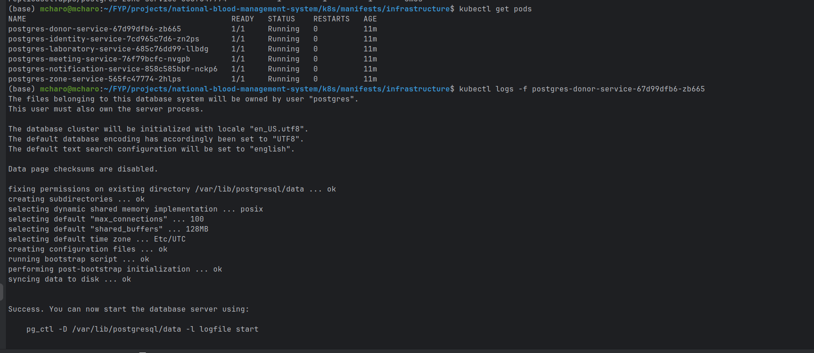

### Forwarding Postgres Pod Port to External
List all svc
```shell
kubectl get svc
```

Select svc then forward the port
```shell
 kubectl port-forward svc/postgres-zone-service  5436:5436
```
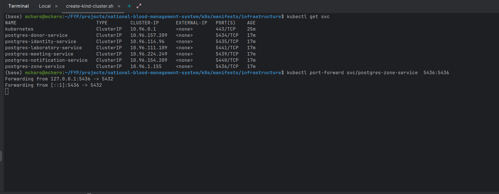

### Stopping / Cleaning up
If you want to delete the Postgres deployment, service, and secrets:
```bash
    kubectl delete -f postgres.yaml
    kubectl delete -f app-secrets
```